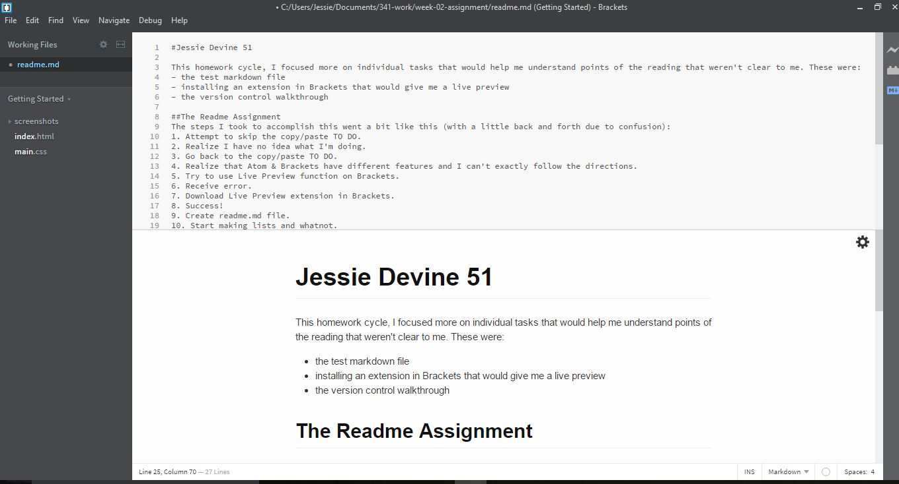

#Jessie Devine 51

This homework cycle, I focused more on individual tasks that would help me understand points of the reading that weren't clear to me. These were:
- the test markdown file
- installing an extension in Brackets that would give me a live preview
- the version control walkthrough

##The Readme Assignment
The steps I took to accomplish this went a bit like this:

1. Attempt to skip the copy/paste TO DO.
2. Realize I have no idea what I'm doing.
3. Go back to the copy/paste TO DO.
4. Realize that Atom & Brackets have different features, and I can't exactly follow the directions.
5. Try to use Live Preview function in Brackets.
6. Receive error.
7. Download Live Preview extension in Brackets.
8. Success!
9. Create readme.md file.
10. Start making lists and whatnot.

As noted above, I did have issues with consistency between Atom (for which the instructions were written) and Brackets. I didn't post to the forum to solve this problem, rather, I just downloaded an extension to fix it. Coming back to this question after I pushed my files to Github, I posted in the forum to figure out why my numbered list wasn't rendering properly online (even though it did on my laptop), and one of my classmates helped me solve the issue in like two minutes. That was awesome!

I'd like to spend more time on the actual function of things than backstory of things. For example, I don't feel I need so much information on the difference between Markdown and Word, but I do need a lot more information on this backtick/code block stuff. Mostly because I can copy/paste it in, for example: `git status` is a command. But I don't really know why or what it's for. Emphasis? Something else I'm missing entirely? I guess I could post this in the issues forum.

I didn't help my classmates work anything out, mostly because I don't know what I'm doing. I feel like any advice I could offer at this point would probably make the problem worse. I'm just trying to muddle through and work issues out myself.

I **did** comment on the post regarding [Sourcetree issues](https://github.com/Montana-Media-Arts/341-work/issues/9), because I couldn't get it to work either. But I don't think that was particularly helpful.

In spite of all this confusion, I ended up with a decent finished product. Here is a screenshot of my file (with the live preview). 