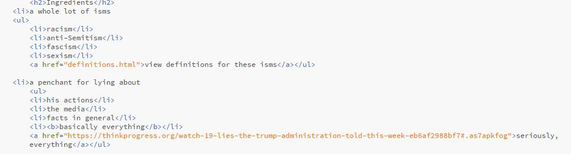

#Jessie Devine 51

This homework cycle, I finally feel like I have my stuff together. I understood the directions clearly, and I didn't run across many issues. Early in the week, I started on my recipe. The first part was pretty easy. I had some fun with it.

I mean, who doesn't want a recipe that's just bound to go wrong???

I struggled a little with my nested lists because no matter what I did, I couldn't get them to quit breaking weirdly. 

Maybe it's just my browser (Chrome?)? I tried just about everything to make mine look like the example on the instructions page, but no such luck.

The only other issue I ran into was finding an email address for the person I wanted my page to link to. I ended up going with the defaul formula Facebook email address, because if you have a Facebook, you have a Facebook email.

That's about it for this week. I liked this project. I can't wait until we get to add colors and stuff.