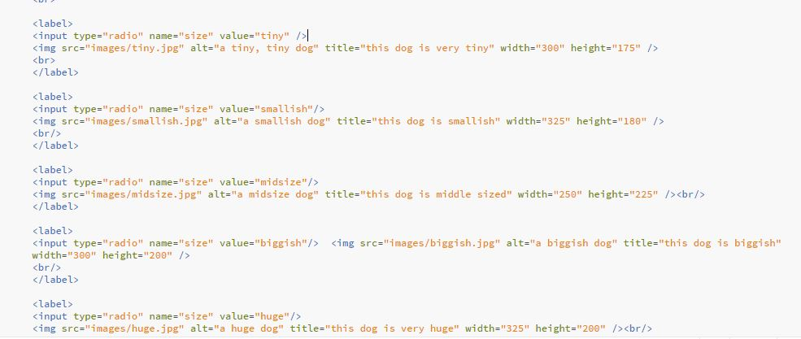
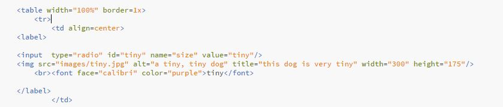

#Jessie Devine 51

I enjoyed this project. I decided to make a survey about dogs, including radio buttons, a submit button, and some editable fields.
I also played around with format, font, and color.

Something that helped me out a lot was the info on the tables. I used a table to organize my radio buttons. They're still not as nice looking as I'd like. I was trying to get the actual circle bit of the radio button to appear on top of the image or to disappear entirely, but the tutorials I found online were too difficult. I spent a long time on it, but I couldn't figure it out. I'm happy with the result I got with the table, though.

^^This is the code I started with, and it looked terrible. I tried sorting out the format without a table at first, and it did not work out. After I arranged evertyhing in a table, it was better. I put each button in its own cell.

The only other issue I ran into was getting my submit button to work with my required fields. I created a second webpage, a simple "Thanks for submitting!" page, and I made my submit button redirect to it. The problem was, whenever I got it to redirect, it would ignore my required fields (the form could be submitted without filling in the fields). I couldn't make the two things coexist, so I deleted the thank you page and made a different external link.

I'm still grumpy that all my submit button does is refresh the page. I want a thank you page. It looked like this:

I left the code in my folder. Maybe someone can help me sort it out in Issues. I also checked in on the issues forum, but I didn't see any problems I could solve. I'll try again next week.