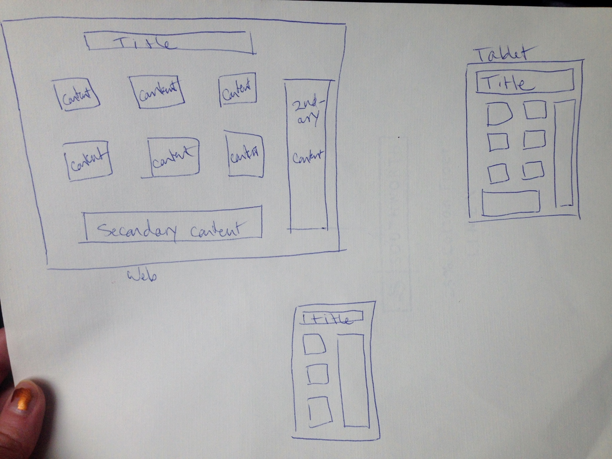

# Jessie Devine - MART 341, Week 10

I started with wireframe sketches this week. Instead of starting with a mobile sketch, I started with the web sketch, then went to tablet size, then to mobile. This was easier for me to do because:

- I could start by organizing my content instead of thinking of screen constraints.
- I could imagine how the original content would need to move around to fit a smaller screen (instead of sizing it up, which made more sense to me).
- I was able to format using my whole laptop screen, which made the final product better in my opinion.

Here are my wireframe sketches:

This assignment also asked me to answer the following questions:
1. <b>What is the information this page aims to deliver?</b> The information this page aims to deliver is educational info about responsive web design: what it is, how it works, and why people use it.

2. <b>What is the first information on the page that should draw the eye?</b> The first information on the page is the title. This should draw the eye because it tells the user what the page will be about.

3. <b>What is the primary content of this page?</b> The primary content on this page will be located in the small boxes, and it will contain information about what makes responsive web design work.

4. <b>What is the secondary content?</b> The secondary content is minor stuff (I'm intending to put it in the bottom, fat box) that will engage the reader to interact with the page and discover RWD for themselves.

I'm going to use a fun, bright background to deliver some kind of dry information. I'm also going to use more fun, block type and striking contrast to keep the page engaging.